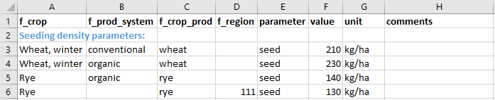
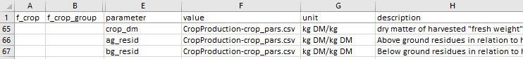
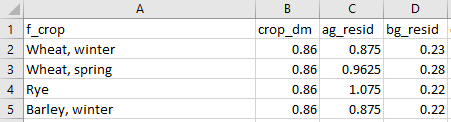
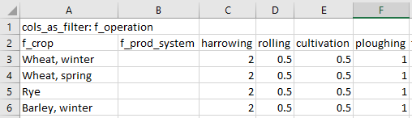
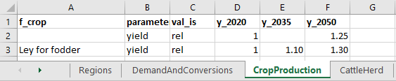
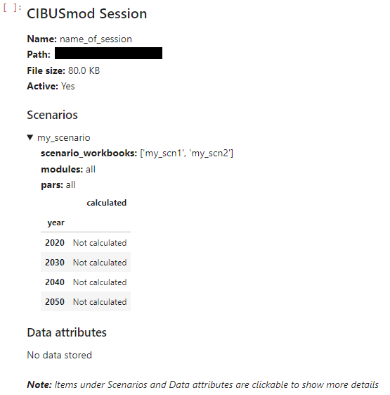
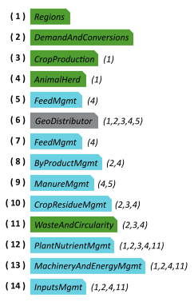

# Users guide

1. [Introduction](#introduction)
1. [Installation](#installation)
1. [Importing CIBUSmod](#importing-cibusmod)
1. [Data structure](#data-structure)
    - [Setting data folder path](#setting-data-folder-path)
    - [Default data workbooks](#default-data-workbooks)
    - [Scenario data workbooks](#scenario-data-workbooks)
1. [Defining and running scenarios](#defining-and-running-scenarios)
    - [Adding scenarios to a `Session`](#adding-scenarios-to-a-session)
    - [Initialising CIBUSmod modules and performing the calculations](#initialising-cibusmod-modules-and-performing-the-calculations)
    - [Storing model output](#storing-model-output)
1. [Retrieving model output](#retrieving-model-output)

# Introduction
Intro here


This users guide assumes that `CIBUSmod` is run in a Jupyter notebook (i.e. a *.ipynb* file).

# Installation
Here step-by-step instructions for installing CIBUSmod and other required software are provided for Windows users. For other operating systems it should be possible to use a similar procedure.

## Installing Python and Git
CIBUSmod requires working installations of Python and Git. So, if these are not already installed, do so first.

### Python
- Download python from here: https://www.python.org/downloads/windows/
- CIBUSmod has been tested on version ´3.11.6´, so use that version to be safe
- Run the installer. In the installer check “Add python.exe to PATH”

### Git
- Download Git from here: https://git-scm.com/download/win
- Latest version should be fine
- Run the installer and leave all settings at default values, except changing default branch name to “main” if you want.

## Installing CIBUSmod
Open a new `Command Prompt` and `cd` to the directory where you want to place CIBUSmod and download the CIBUSmod code from github.

```
git clone https://github.com/SLU-foodsystems/CIBUSmod
cd CIBUSmod
```
Next, create and activate a new virtual environment to keep Python packages needed for CIBUSmod separate from your base Python installation.
```
python -m venv .venv --clear --upgrade-deps --prompt 'CIBUSmod-venv'
.venv\Scripts\activate
```
After activating the virtual environment, make sure that you see `('CIBUSmod-venv')` at the beginning of the command line, which indicates that the virtual environment is active. Now it´s time to install all python packages needed to run CIBUSmod and start jupyter lab.
```
pip install --upgrade pip
pip install --require-virtualenv -r requirements.txt
ipython kernel install --user --name="CIBUSmod-venv"
jupyter lab
```
Once jupyter lab is started, navigate to the `notebooks` folder and open one of the notebooks. Make sure that the `CIBUSmod-venv` kernel is selected via `Kernel > Change kernel > CIBUSmod-venv`. Run the notebook. That's it!

After quitting jupyter lab and returning to the `Command Prompt`, type `deactivate`, or simply close the `Command Prompt`, to exit the virtual environment,

Next time, you open a new `Command Prompt`, `cd` to the `CIBUSmod` directory and activate the virtual invironment before starting `jupyter lab`.
```
.venv\Scripts\activate
jupyter lab
```

## Adding licence for Gurobi
Gurobi is the back-end solver used in CIBUSmod to solve the convex optimisation problem involved in regionally distributing crops and animals. This is a comercial softwarde and therefore require a licence to run, but free academic licences are provided. 
- Create an account at https://www.gurobi.com using your university e-mail
- Go to: https://portal.gurobi.com/iam/licenses/request/?type=academic
  and generate a “Named-User Academic” licence. You must be connected to the internet via your university (VPN should work). Copy the grbgetkey line you receive and keep it.
- Get the licence manager “grbgetkey” from here: https://support.gurobi.com/hc/en-us/articles/360059842732-How-do-I-set-up-a-license-without-installing-the-full-Gurobi-package
- Unpack the “grbgetkey.exe” file in any folder. Open the command prompt and go to that folder. Copy and run the grbgetkey command you got earlier. You should now see some messages and get to decide where to put the licence file.

# Importing CIBUSmod
To be able to import `CIBUSmod` in a Jupyter notebook, it first needs to be added to the system path. This is done via Python's `sys` module:

```Python
import sys
sys.path.insert(0, 'C:\path\to\CIBUSmod')
import CIBUSmod as cm
```

or using a path relative to the current working directory (i.e. the directory of the present notebook)

```Python
import sys
import os
sys.path.insert(0, os.path.join(os.getcwd(),'..'))
import CIBUSmod as cm
```

The above code assumes that the notebook is located in a folder contained in the main `CIBUSmod` folder.


# Data structure
All data used to run the model and outputs produced are stored in a data folder with the folder structure shown below. The `default` and `scenarios` folders stores all default input data and data used to define different scenarios in the form of Excel workbooks. The `output` folder stores model outputs in SQLite database files and the `ecoinvent` folder stores ecoinvent activity data use by the `InputsMgmt` module.

```bash
 data
 |
 ├── default
 │   ├── *.xlsx
 │   └── *.csv
 ├── ecoinvent
 │   └── *.xml
 ├── output
 │   └── *.sqlite
 ├── scenarios
 │   └── *.xlsx
 └── relation_tables.xlsx
```

## Setting data folder path
The path to the datafolder is set by initialising a new `Session` object with a `name` and a `data_path`. This also sets the `ParameterRetriever.data_path` class attribute which is used by all modules when accessing default and scenario data workbooks.

```python
my_session = cm.Session(
    name = 'name_of_session',
    data_path = '../path/to/data'
)
```

`my_session` then connects to the SQLite database file in `data/output/name_of_session.sqlite` or creates it if it does not already exist. This database file stores all scenario definitions and model outputs. If the database already contains model outputs these will become directly available through the `my_session` object (see [Retrieving model outputs](#retrieving-model-outputs)).

> [!TIP]
> When instantiating a `Session` object, it's also possible to independently set the paths to the *default*, *scenarios* and *output* data folders via the arguments `data_path_default`, `data_path_scenarios` and `data_path_output`.

## Default data workbooks
All data used to run the model (referred to as parameters) are stored in Excel workbooks in `data/default/`. This folder contains one Excel workbook for each CIBUSmod module. When a module is initialised it is done so with a `ParameterRetriever` object that is responsible for accessing parameters. The name defined for the `ParameterRetriever` object correspond to the name of the Excel workbook where it will access parameters.

Below the `Regions` module is initialised and uses parameters in `data/default/Regions.xlsx`

```python
regions = cm.Regions(
    par = cm.ParameterRetriever('Regions')
)
```

The Excel workbooks should contain one sheet named `default` where all data is stored. All other sheets in the workbook are ignored and may be used freely to e.g. document data collection.

The first row in the `default` sheet contains column headings. When the `ParameterRetriever` reads the Excel file only columns with the headings `parameter`, `value` and all starting with `f_` are retained. Other columns can again be used for documentation. All rows that do not have anything in the `parameter` column are also skipped, allowing for e.g. headings separating different groups of parameters in the Excel sheet (see example below).

The `parameter` columns is used for the parameter names and the `value` columns for the corresponding value. A parameter value can only be a number (equations and references are OK) or the name of an external .csv file containing additional parameter values (more on that later).

All columns starting with `f_` are interpreted as "filter levels". When the model tries to access a parameter value it does so by providing a set of filters. The `ParameterRetriever` then tries to find the single parameter value that most closely matches the supplied filter. If a single value can't be returned, `NaN` is returned and a warning with some additional information is printed.

For example, when the `CropProduction` module accesses the parameter `seed` (defining the seeding density in kg/ha) it does so with the filter levels `crop`, `prod_system`, `region` and `crop_prod` (e.g. `crop='Wheat, winter'`, `prod_system='conventional'`, `region='111'` and `crop_prod='wheat'`). Assuming that the parameter sheet looks like below the value `210` would be returned as `crop='Wheat, winter'`, `prod_system='conventional'` and `crop_prod='wheat'` represents a unique match as no other value is equally well defined (i.e. with the same number of matching filters).  As the `f_region` column was left blank for the rows representing 'Wheat, winter' the `region` filter level could be ignored.

 \
*Example of default Excel data sheet*

However, trying to access the `seed` parameter for `crop='Rye'`,`prod_system='organic'`, `region='111'` and `crop_prod='rye'` would yield `NaN` and a warning since there are two equally well defined matches on either `crop`, `prod_system` and `crop_prod` or `crop`, `crop_prod` and `region`. This represents an error in the parameter Excel sheet and would need to be corrected there.

> [!TIP]
> The filter levels used in the model when accessing different parameters are stored in the `.qry_log` attribute of each `PrameterRetriever` object.

### Using external .csv-files
The Excel workbooks for default parameters can be extended with .csv-files. This is done by writing the file name of a .csv-file in the default data workbook under the `value` column instead of a parameter value. The csv files needs to be located in `data/default` (see example below). Filter values specified for that row are ignored, instead these need to be specified in the .csv-file.

 \
*Example of how to read data from external .csv-file via default workbooks*

The .csv-files can be structured in two ways, either with *parameters as columns* or with *filter values as columns*. In the first case (i.e. *parameters as columns*) the first row in the .csv-file is interpreted as column headings and any column heading preceded by `f_` is interpreted as a filter level in a similar way as in the default data workbooks. Other column headings are interpreted as parameter names (see example below). Only columns corresponding to the parameter names specified in the default workbook are retrieved (see example above where the same .csv-file is defined for multiple parameters).

 \
*Example of .csv-file with **parameters as columns** structure*

The second structure (i.e. *filter values as columns*) is invoked by writing `cols_as_filter: <filter level>` in the first cell of the .csv-file, where `<filter level>` is a filter level name preceded by `f_`. The second row is then interpreted as column names and any column name preceded by `f_` are assumed to represent filter levels and all other columns are assumed to represent filter values on the level specified in the first cell of the .csv-file (see example below). The parameter name is inferred from the parameter name stated in the default data workbook on the row referring to the .csv-file.

 \
*Example of .csv-file with **filter values as columns** structure*

## Scenario data workbooks
Scenarios are defined in Excel workbooks located in `data/scenarios/`. When defining scenarios only parameters that are to be changed compared to the default values need to be specified. Any parameters not defined in a scenario data workbook are retained with their default values. The scenario data workbooks should contain one sheet per module where parameters are to be changed in the scenario (see example below). Sheet names need to match the filenames of corresponding default data workbooks (without the .xlsx file extension). Each sheet needs to include the column headings `parameter` and `val_is` as well as at least one defined year (column headings starting with `y_`). They may also include column headings for filter levels (starting with `f_`).

 \
*Example of scenario Excel data sheet*

Changes in parameter values can be specified in absolute or relative terms by writing `'abs'` or `'rel'` in the `val_is` column, respectively. When specifying parameter values in relative terms a factor to be multiplied by the parameter's default value is specified. So, in the above example the yield of all crops are increased by 25% (factor 1.25) to 2050 compared to their respective default yields, except if `crop` equals `'Ley for fodder'` in which case the yield is increased by 30% (factor 1.3). When specifying scenario parameter values in absolute terms these will directly replace the corresponding default parameter values. Values specified in absolute terms directly replace corresponding default values.

When the model updates parameter values it goes through all default parameter values and tries to find the one scenario parameter value with the largest number of matching filter levels analogously with how parameter values are located when running the model (as described above). This means that parameter values to change in a scenario can only be defined at the same level of specificity or in more general terms than default parameter values (i.e. applying to one or several default parameter values, such as in the case of yield above) but never more precise. So, if the default value for the parameter `seed` from the earlier example is defined for the filter levels `crop`, `crop_prod` and `prod_system` a scenario can't change this parameter independently on the `region` level using `'abs'` or `'rel'` in the `val_is` column.

To add more precise definitions to parameters (or e.g. define a new crop) in a scenario the keword `'new'` is used in the `val_is` column. These values are allways supplied in absolute terms and will be appended to the data exactly as specified in the scenario data workbook (i.e. with the same filter levels and values).

In some cases it may also be desirable to drop parameter values from the default data in a scenario. This can be achieved by using the keyword `'drop'` in the `val_is` column. To identify parameters in default data to be dropped each row with the `'drop'` keword is matched to parameters in the default data in the same way as when using the `'abs'` or `'rel'` keywords. In order for parameters to be dropped a number (preferably 1) must be specified under the `y_` column. 

> [!CAUTION]
> When using the `abs` keyword in the `val_is` columns it is important to make sure that the scenario parameter value corresponds to only the desired default parameter value (i.e. by using the exact same filter levels and values in the scenario data workbook as in the default data workbook) to avoid replacing unintended parameter values.

Scenario parameter values can be specified for any chosen years by adding columns with `y_` prefix. When the model updates parameter values for a given scenario and year it will use values specified under the corresponding year if available. If that year is not specified but an earlier **and** a later year is available, it will linearly interpolate between those years. If only an earlier year is available it will use that value and if only a later year is available it will not update parameter values.

# Defining and running scenarios

## Adding scenarios to a `Session`

To run a scenario defined in one or more scenario data workbooks it first needs to be added to the `Session` object. This is done via the method `.add_scenario()`, which takes five arguments; `name`, `years`, `scenario_workbooks`, `modules` and `pars`.

```python
my_session.add_scenario(
    name = 'my_scenario',
    years = [2020, 2030, 2040, 2050],
    scenario_workbooks = ['my_scn1', 'my_scn2'],
    modules = 'all',
    pars = 'all'
)
```

The `name` argument gives the scenario a name which is what will be printed in output tables etc. and the `years` argument specifies the years to be run. The `scenario_workbooks` argument is the filename(s) (exuding the .xlsx extension) of the scenario data workbook(s) to use. If a list of multiple workbooks is given, as in the example above, these are handled in consecutive order. If multiple scenario data workbooks **modify** the same default parameter only the last one in the list will have an effect. The arguments `modules` and `pars` controls for which modules parameter values should be updated and which parameters to update, respectively. `pars` can also take a `dict` with module names as keys and parameters as values to restrict parameters to update only for certain modules. Using the keyword `'all'` means that all modules and/or parameters included in the scenario data workbooks will be updated. 

Displaying a `Session` object (i.e. calling it in a code block) will give an overview of the `Session` including name, path defined scenarios and available output data attributes. 

```Python
my_session
```



The overview is interactive and clicking the items under *Scenarios* and *Data attributes* will show additional information. In the example above the details for 'my_scenario' has been expanded and the `Session` object does not contain any stored output data.

> [!TIP]
> Additional `Session` methods for working with scenario definitions are `.remove_scenario()`, `.update_scenario()` and `.reorder_scenarios()`.

## Initialising CIBUSmod modules and performing the calculations

This section gives a breif overview of running the model. See the example notebooks for a more hands-on guide.

As previously indicated CIBUSmod is built up of several modules responsible for performing different parts of the calculations. The modules are subdivided into *main modules* and *management (mgmt) modules*, where the main modules store all output and mgmt modules perform specific calculations and add/adjust data stored on the main modules. All modules take a `ParameterRetriever` object as an input. In addition, many modules require other modules as input and some modules also take additional settings as input.

The figure below shows all modules currently included in CIBUSmod. The order from top to bottom (1-14), is the order in which modules should be run and the numbers to the right indicate which other module that module require as input. 



To get more information on a module write the module name followed by a questionmark in a Jupyter notebook cell.

```python
cm.ManureMgmt?
```

After initialising all modules, the first step in a model run is usually to update all parameters according to a specific scenario an year. This can be done for all initialised `ParameterRetriever` objects via the class method `ParameterRetriever.update_all_parameter_values`.

```python
cm.ParameterRetriever.update_all_parameter_values(
    **my_session['my_scneario'],
    year = '2030'
)
```

This will access the scenario definition in the `Session` object (via `**my_session['my_scneario']`) and update all modules and parameters according to the scenario workbooks specified.

After updating parameters, running the model involves executing the `.calculate()` method for all modules in consecutive oreder.

A special case is the `GeoDistributor` module which is the core module that solves the optimisation problem that distributes crop areas and animal numbers regionally. This module is run by first executing its `.make()` method followed by the `.solve()` method. See `cm.GeoDistributor.make?` and `cm.GeoDistributor.make?` for details.

## Storing model output

After running all modules for a specific scenario and year, results are stored by calling `my_session.store()`. This method requires the arguments `scn` and `year` which specifies under which scenario and year results should be stored. These are followed by all main modules to be included in the data (usually all of them).

> [!NOTE]
> The database files grows quite large in size (~120 MB per scenario $\times$ year) so it may be a good idea to limit the number of scenarios+years contained in one session. If many scenarios have ben added/removed, running the `.clean()` method will tidy up the database file and potentially save som space (but it's quite slow).

# Retrieving model output

The main method for accessing model output is `cm.Session.get_attr()`. It requires the arguments `module` and `attr` which is the module name (e.g. 'CropProduction') and attribute table (e.g. 'area') to get data from, respectively. Both are case-insensitive and allows just writing the first letters that can uniquely identify a module.

It also takes a `groupby` argument that allows to group outputs by selected "levels". The levels may be supplied as a list or a dict with level name as keys and aggregated level names (as specified in 'relation_tables.xlsx') as values. For example the below code will access crop areas grouped by production system and crop group.

```Python
session.get_attr(
    'C',                                       # 'C' uniquely identifies the 'CropProduction' module
    'area',                                    # Get the 'area' attribute table
    {'crop':'crop_group', 'prod_system':None}  # Group by 'crop' (translated to 'crop_group') and 'prod_system'
)
```

This returns a `pandas.DataFrame` with scenario and year as index and the group by levels as columns.
