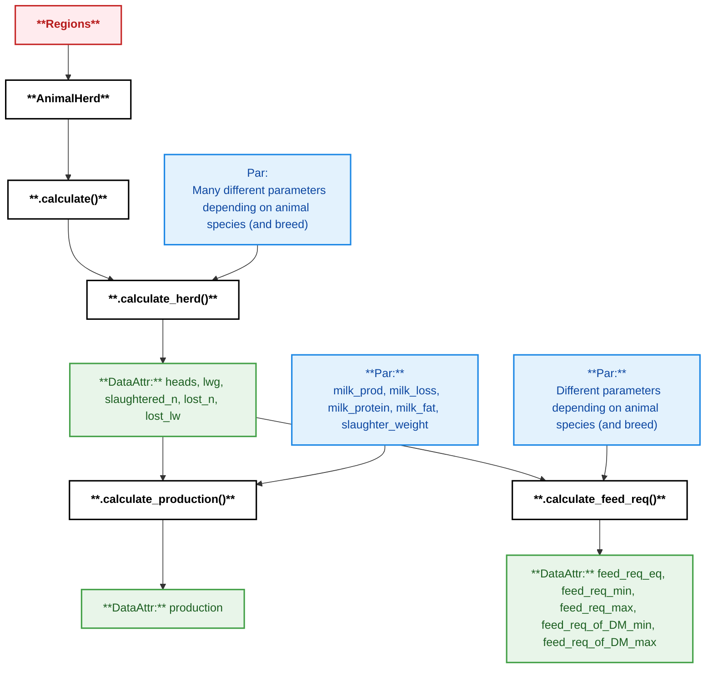

# AnimalHerd

```mermaid
flowchart TD

  %% -------------------------
  %% Main (module family)
  %% -------------------------

  A["**AnimalHerd**"]:::method
  A --> C["**.calculate()**"]:::method

  %% Typical upstream source of x0 and region structure
  R["**Regions**"]:::module --> A


  %% -------------------------
  %% Calculate() – typical sequence
  %% -------------------------

  C --> HS["**.calculate_herd()**"]:::method
  FEED["**.calculate_feed_req()**"]:::method
  PROD["**.calculate_production()**"]:::method

  %% -------------------------
  %% Herd structure
  %% -------------------------
  P_HS["
  Par:
  Many different parameters depending on animal species (and breed)
  "]:::param
  P_HS --> HS

  HS --> DA_HS["**DataAttr:** heads, lwg, slaughtered_n, lost_n, lost_lw"]:::data

  DA_HS --> PROD

  %% -------------------------
  %% Feed requirements
  %% -------------------------

  DA_HS --> FEED
  P_FEED["
  **Par:**
  Different parameters depending on animal species (and breed)
  "]:::param --> FEED

  FEED --> DA_FEED["**DataAttr:** feed_req_eq, feed_req_min, feed_req_max, feed_req_of_DM_min, feed_req_of_DM_max"]:::data

  %% -------------------------
  %% Livestock product outputs
  %% -------------------------
  P_PROD["
  **Par:**
  milk_prod, milk_loss, milk_protein, milk_fat, slaughter_weight
  "]:::param --> PROD

  PROD --> DA_PROD["**DataAttr:** production"]:::data


  %% -------------------------
  %% Styles (add module class in red)
  %% -------------------------

  classDef module fill:#ffebee,stroke:#c62828,stroke-width:2px,font-weight:bold,color:#b71c1c;
  classDef method fill:#ffffff,stroke:#000000,stroke-width:2px,font-weight:bold,color:#000000;
  classDef param fill:#e3f2fd,stroke:#1e88e5,stroke-width:2px,color:#0d47a1;
  classDef data fill:#e8f5e9,stroke:#43a047,stroke-width:2px,color:#1b5e20;
  classDef helper fill:#f5f5f5,stroke:#616161,stroke-width:1.5px,color:#212121;
```