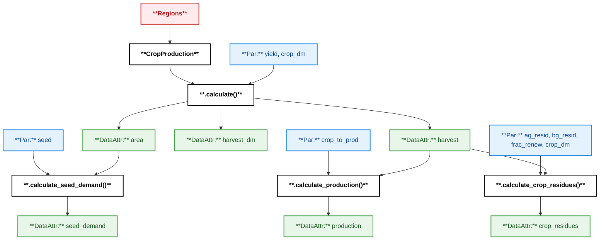

# CropProduction

```mermaid
flowchart TD

  %% -------------------------
  %% Main
  %% -------------------------

  A["**CropProduction**"]:::method
  A --> C["**.calculate()**"]:::method

  R["**Regions**"]:::module --> A

  %% -------------------------
  %% Calculate() sequence
  %% -------------------------

  C --> DA_A["**DataAttr:** area"]:::data

  P_Y["**Par:** yield, crop_dm"]:::param --> C

  C --> DA_H["**DataAttr:** harvest"]:::data
  C --> DA_HDM["**DataAttr:** harvest_dm"]:::data

  CP["**.calculate_production()**"]:::method
  CR["**.calculate_crop_residues()**"]:::method
  SD["**.calculate_seed_demand()**"]:::method

  %% -------------------------
  %% Production (crop -> crop_prod mapping)
  %% -------------------------

  P_C2P["**Par:** crop_to_prod"]:::param --> CP
  DA_H --> CP
  CP --> DA_P["**DataAttr:** production"]:::data

  %% -------------------------
  %% Crop residues (above/below ground)
  %% -------------------------

  P_RES["**Par:** ag_resid, bg_resid, frac_renew, crop_dm"]:::param --> CR
  DA_H --> CR
  CR --> DA_CR["**DataAttr:** crop_residues"]:::data

  %% -------------------------
  %% Seed demand
  %% -------------------------

  P_SEED["**Par:** seed"]:::param --> SD
  DA_A --> SD
  SD --> DA_SD["**DataAttr:** seed_demand"]:::data


  %% -------------------------
  %% Styles
  %% -------------------------

  classDef method fill:#ffffff,stroke:#000000,stroke-width:2px,font-weight:bold,color:#000000;

  classDef param fill:#e3f2fd,stroke:#1e88e5,stroke-width:2px,color:#0d47a1;

  classDef data fill:#e8f5e9,stroke:#43a047,stroke-width:2px,color:#1b5e20;

  classDef module fill:#ffebee,stroke:#c62828,stroke-width:2px,font-weight:bold,color:#b71c1c;
```