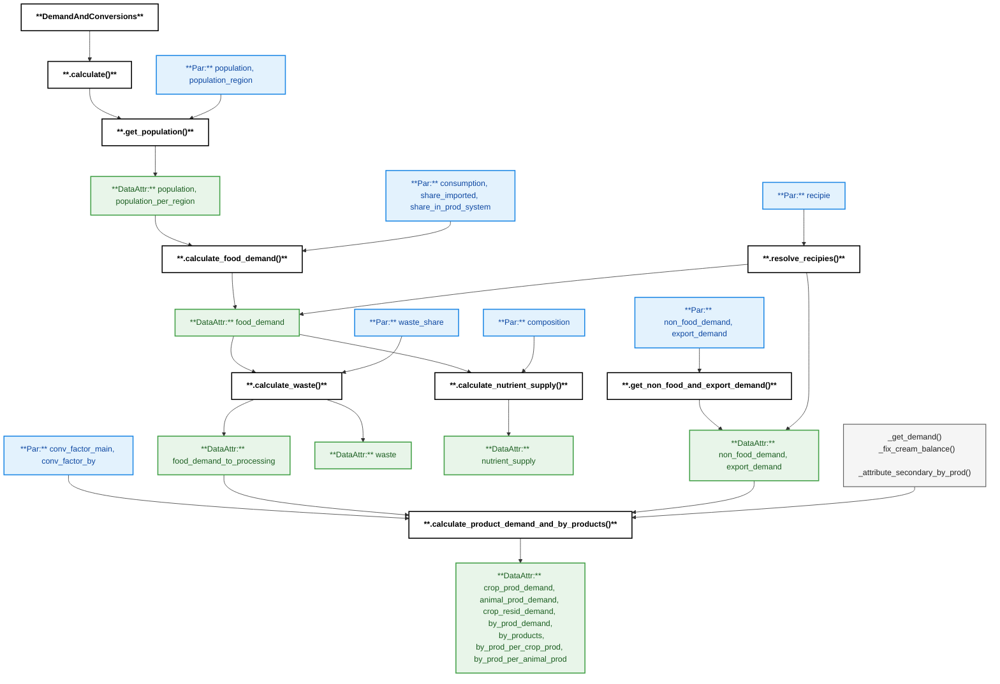

# DemandAndConversions

```mermaid
flowchart TD

  %% -------------------------
  %% Main orchestration
  %% -------------------------
  A["**DemandAndConversions**"]:::method --> C["**.calculate()**"]:::method

  C --> GP["**.get_population()**"]:::method
  FD["**.calculate_food_demand()**"]:::method
  NFX["**.get_non_food_and_export_demand()**"]:::method

  %% Resolve recipes for multiple demand tables
  RR["**.resolve_recipies()**"]:::method

  W["**.calculate_waste()**"]:::method
  NS["**.calculate_nutrient_supply()**"]:::method
  PD["**.calculate_product_demand_and_by_products()**"]:::method


  %% -------------------------
  %% Population
  %% -------------------------
  P_POP["**Par:** population, population_region"]:::param --> GP

  GP --> DA_POP["**DataAttr:** population, population_per_region"]:::data
  DA_POP --> FD


  %% -------------------------
  %% Food demand (diet -> kg/year by origin & production system)
  %% -------------------------
  P_CONS["**Par:** consumption, share_imported, share_in_prod_system"]:::param --> FD

  FD --> DA_FD["**DataAttr:** food_demand"]:::data
  DA_FD --> W
  DA_FD --> NS

  %% -------------------------
  %% Non-food + Export demand
  %% -------------------------
  P_NFX["**Par:** non_food_demand, export_demand"]:::param --> NFX

  NFX --> DA_NFX["**DataAttr:** non_food_demand, export_demand"]:::data


  %% -------------------------
  %% Recipe resolution (compound foods -> ingredients)
  %% -------------------------
  RR --> DA_FD
  RR --> DA_NFX
  P_REC["**Par:** recipie"]:::param --> RR

  %% -------------------------
  %% Waste calculation (stage losses)
  %% -------------------------
  P_WASTE["**Par:** waste_share"]:::param --> W
  W --> DA_FTP["**DataAttr:** food_demand_to_processing"]:::data
  W --> DA_W["**DataAttr:** waste"]:::data

  %% -------------------------
  %% Nutrient supply (diet composition)
  %% -------------------------
  P_COMP["**Par:** composition"]:::param --> NS
  NS --> DA_NDA_NS["**DataAttr:** nutrient_supply"]:::data


  %% -------------------------
  %% Product demand & by-products
  %% -------------------------
  P_CF["**Par:** conv_factor_main, conv_factor_by"]:::param --> PD

  %% Inputs to demand aggregation
  DA_FTP --> PD
  DA_NFX --> PD

  %% Outputs
  PD --> DA_CPD["**DataAttr:** crop_prod_demand, animal_prod_demand, crop_resid_demand, by_prod_demand,
  by_products, by_prod_per_crop_prod, by_prod_per_animal_prod"]:::data

  %% (Optional) internal helper logic (not class methods)
  PD_H["_get_demand()
  _fix_cream_balance()
  _attribute_secondary_by_prod()
  "]:::helper --> PD


  %% -------------------------
  %% Styles
  %% -------------------------
  classDef method fill:#ffffff,stroke:#000000,stroke-width:2px,font-weight:bold,color:#000000;

  classDef param fill:#e3f2fd,stroke:#1e88e5,stroke-width:2px,color:#0d47a1;

  classDef data fill:#e8f5e9,stroke:#43a047,stroke-width:2px,color:#1b5e20;
  
  classDef helper fill:#f5f5f5,stroke:#616161,stroke-width:1.5px,color:#212121;
```