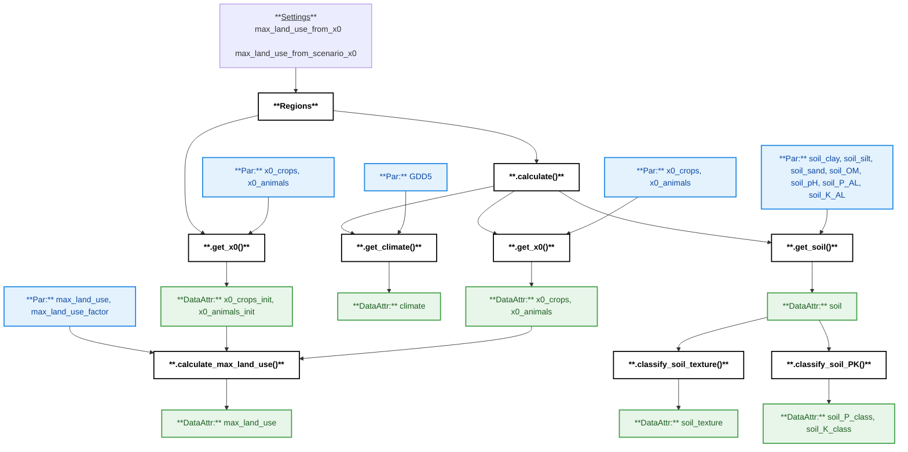

# Regions

```mermaid
flowchart TD

  %% -------------------------
  %% Main
  %% -------------------------

  A["**Regions**"]:::method

  A --> C["**.calculate()**"]:::method

  S["
  **<u>Settings</u>**
  max_land_use_from_x0
  max_land_use_from_scenario_x0
  "] --> A

  A --> GX0_1["**.get_x0()**"]:::method
  C --> GX0_2["**.get_x0()**"]:::method
  C --> CL["**.get_climate()**"]:::method
  C --> SL["**.get_soil()**"]:::method
  SL_T["**.classify_soil_texture()**"]:::method
  SL_PK["**.classify_soil_PK()**"]:::method
  MLU["**.calculate_max_land_use()**"]:::method

  %% -------------------------
  %% Get x0
  %% -------------------------
  
  P_X0_1["**Par:** x0_crops, x0_animals"]:::param --> GX0_1
  GX0_1 --> DA_X0_1["**DataAttr:** x0_crops_init, x0_animals_init"]:::data

  P_X0_2["**Par:** x0_crops, x0_animals"]:::param --> GX0_2
  GX0_2 --> DA_X0_2["**DataAttr:** x0_crops, x0_animals"]:::data

  %% -------------------------
  %% Climate
  %% -------------------------

  P_CL["**Par:** GDD5"]:::param --> CL
  CL --> DA_CL["**DataAttr:** climate"]:::data

  %% -------------------------
  %% Soil
  %% -------------------------

  P_SL["**Par:** soil_clay, soil_silt, soil_sand, soil_OM, soil_pH, soil_P_AL, soil_K_AL"]:::param --> SL
  SL --> DA_SL["**DataAttr:** soil"]:::data

  DA_SL --> SL_T
  DA_SL --> SL_PK

  SL_T --> DA_SL_T["**DataAttr:** soil_texture"]:::data

  SL_PK --> D_SL_PK["**DataAttr:** soil_P_class, soil_K_class"]:::data

  %% -------------------------
  %% Max land use
  %% -------------------------

  P_MLU["**Par:** max_land_use, max_land_use_factor"]:::param --> MLU

  DA_X0_1 --> MLU
  DA_X0_2 --> MLU

  MLU --> DA_MLU["**DataAttr:** max_land_use"]:::data


  %% -------------------------
  %% Styles
  %% -------------------------

  classDef method fill:#ffffff,stroke:#000000,stroke-width:2px,font-weight:bold,color:#000000;
  classDef param fill:#e3f2fd,stroke:#1e88e5,stroke-width:2px,color:#0d47a1;
  classDef data fill:#e8f5e9,stroke:#43a047,stroke-width:2px,color:#1b5e20;
```